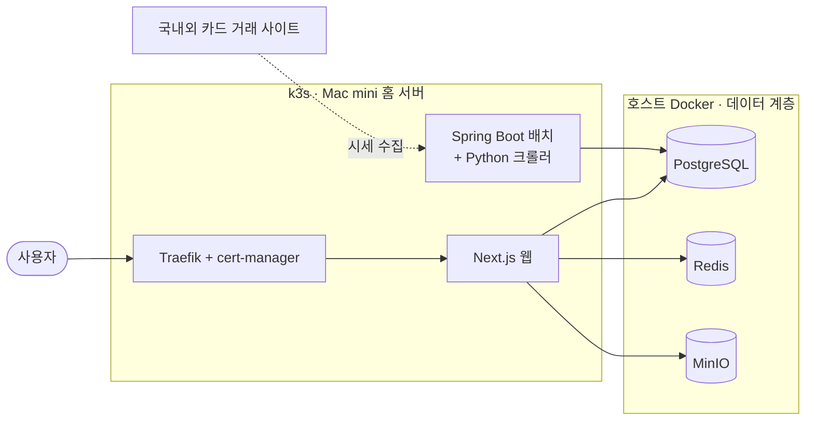

<!-- WalterKor / README.md -->

### 추측은 추측이라고 적고, 확정은 실측으로 합니다.

레거시를 뜯어보고 · 새로 만들고 · 직접 운영하는 4년차 백엔드 개발자

---

## 👋 About

- 원본 소스도, 믿을 만한 문서도 없는 **레거시 시스템**을 로그 · 패킷 · DB 덤프로 역분석해 차세대 시스템으로 옮기고 있습니다.
- 개인 프로젝트로 포켓몬 카드 위키 · 시세 서비스 **[pokepia.kr](https://pokepia.kr)** 를 혼자 기획 · 개발하고, 홈 서버(Mac mini)의 k3s 클러스터에서 운영합니다.
- 프로젝트마다 **Obsidian + Claude Code**로 지식 위키를 만들고, AI가 실수하기 어려운 작업 환경(하네스)을 설계하는 데 관심이 많습니다.

## 🧭 이런 개발자입니다

- 🔍 **실측으로 확정합니다.** 규격서와 로그가 다르면 로그를, 기억과 측정이 다르면 측정을 믿습니다. 독립된 근거가 둘 이상 일치할 때만 "확정"이라고 씁니다.
- 🔁 **만들고, 운영까지 합니다.** 기능 구현에서 끝내지 않고 배포 · 모니터링 · 장애 대응 · RCA 문서화까지 직접 합니다.
- 🛡️ **되돌릴 수 있게 바꿉니다.** 기존 시스템 옆에 새 시스템을 나란히 띄워 검증하고, 롤백 경로를 남긴 뒤에 전환합니다.
- 🤖 **AI에게는 하네스를 먼저 줍니다.** 일을 맡기되, 틀린 결과가 그대로 반영되지 않도록 규칙 · 검증 · 기록 체계를 먼저 만듭니다.

---

## 🔨 Featured Work

### 📞 레거시 VoIP 단말 자동 개통 시스템 차세대 전환 `2026.06 – 현재`

> 수십만 대 인터넷전화 단말이 붙어 있는, 10년 넘게 운영된 개통 시스템을 새로 만드는 프로젝트입니다.
> 원본 소스가 없어 로그 · 패킷 · DB 덤프로 동작을 역분석했고, 성공 기준은 **"이미 현장에 깔린 단말이 지금처럼 동작하는 것"** 입니다.

`Oracle 11g · Servlet · C 프로세스` → `Spring Boot MSA · PostgreSQL · Vue · k3s`

- **개통 API · API Gateway 신규 구축** — Spring Cloud Gateway로 기존 URL을 그대로 받아내, 단말 펌웨어 수정 없이 전환
- **3DES 구현 검증** — 규격서대로 구현하면 트래픽의 **7.9%** 가 복호에 실패한다는 것을 로그 대조로 발견(원인: MAC 주소 대소문자). 로그의 실제 키 값과 openssl 계산값을 맞춰 검증
- **단말 개통 실패 원인 규명** — 패킷 캡처 16회와 직접 만든 리플레이 서버로 변수를 하나씩 소거해, 원인이 응답 프레이밍(`Content-Length` vs `chunked`)임을 밝히고 `StreamingResponseBody`로 해결
- **레거시 로그 포렌식** — 운영 로그를 전수 분석해 기존 문서의 오해 14건을 바로잡고, 민감정보가 평문으로 남던 로깅을 새 설계에서 제거
- **k3s 전환 PoC (하루)** — VM 4대에 전체 스택 구성, 노드 사망 · 재부팅 시험 **9회 전부 통과**, CloudNativePG 동기 복제로 **데이터 유실 0**, Consul → Service DNS 전환은 **Java 코드 변경 0줄**
- **파일 서버 PoC** — 스토리지 어댑터 경계 뒤에 SeaweedFS를 두고, 노드 장애 시 **유실 0(md5 검증) · 리더 재선출 ≤ 8초** 를 실측해 유료 솔루션 대신 오픈소스 도입을 제안 · 발표
- **Oracle → PostgreSQL 16 변환 리허설** — 100개 테이블 · 296만 행을 스크립트만으로 적재하고 원본과 행 단위로 전수 대조
- **통합 모니터링 대시보드** — 기존 운영 화면 6종을 Vue로 이관, Prometheus(PromQL) · cAdvisor · node_exporter 연동

 

### 🃏 [pokepia.kr](https://pokepia.kr) — 포켓몬 카드 위키 · 시세 · 커뮤니티 `2026.03 – 현재 · 1인 개발/운영`

- **스택** — Next.js 16 (App Router) · React 19 · TypeScript · Tailwind v4 / Spring Boot 4 · Java 25 / PostgreSQL · Redis · MinIO / k3s · Traefik
- **인증** — 카카오 · 네이버 OAuth + JWT(HttpOnly) + Redis 세션, 로그인 시도 제한, OAuth state 기반 CSRF 방어
- **Docker Compose → k3s 무중단 전환** — 기존 스택을 끄지 않고 나란히 띄워 검증하고, 데이터 계층은 클러스터 밖으로 분리. 이 설계 덕분에 이후 운영 네임스페이스가 통째로 삭제된 사고에서도 **데이터 손실 없이 복구**
- **배치 서버 PID 고갈 장애 해결** — 크롤러 좀비 프로세스가 쌓이는 원인(Java가 PID 1)을 찾아 `tini` 도입 + 가상 스레드 기반 타임아웃 워치독 적용
- **시세 파이프라인 감사** — 건별 거래가 하루 평균 1건으로 뭉개지던 적재 로직을 찾아 건별 거래 로그로 전환. 같은 감사에서 타임존(UTC↔JST) 때문에 거래일이 밀리는 문제, `.gitignore`가 마이그레이션 파일을 조용히 제외하던 문제도 발견
- **API 레이어 3계층화 파일럿** — Route Handler 200줄 → **63줄**, 과정에서 잠재 버그 3건 발견(`OFFSET NaN`, 동시 요청 경합, 통화 단위 오표기)
- **이미지 전송 최적화** — 콘텐츠 해시 키 + immutable 캐시 + WebP 변환으로 용량 **50~70% 절감**
- **전체 리디자인** — 56개 파일, WCAG AA 명암비 확보, 디자인 토큰 일원화

 

### 📊 공공기관 상황관리 대시보드 — 지표 연계 모니터링 `2026.06`

> 외부 기관 11곳 → 수집 서버(Spring WebFlux) → InfluxDB → API 서버(Spring Boot) → React 대시보드

- **지표 40개 ↔ 수집 배치 154개 연계 현황 화면 설계 · 구현 (백엔드 + 프론트)** — 통계코드 기반 역추적 쿼리, Flyway 마이그레이션, 상태 4단계 판정, `Promise.allSettled`로 부분 실패 허용, 주기 폴링과 카드 클릭 재실행
- 매핑 로직을 **프론트 하드코딩 → 백엔드 역추적 → 일괄 조회 API** 로 단계적으로 옮기고, N:M 직접 매핑 테이블 개편안까지 제안
- 로그인 없는 대국민 공개 상황판 리뉴얼 — 기존 컴포넌트를 건드리지 않는 방식으로 확장

 

### 🤖 AI 하네스 & LLM Wiki

> *Agent = Model + Harness.* AI가 잘못 행동하기 어려운 환경을 먼저 만듭니다.

- 업무 · 개인 프로젝트 · 학습 · 뉴스까지 **5개 Obsidian 볼트를 LLM Wiki로 운영** (노트 1,000여 개)
  - `raw`(원본, 불변) / `wiki`(AI가 작성 · 교차참조) / `schema`(규칙) 3계층 — 사람은 자료 선별과 질문, AI는 정리와 기록
- **직접 만든 Claude Code 스킬**
  - `log` — git 작업 내역을 repo에 연결된 볼트에 업무 단위 worklog로 기록
  - `code-review-log` — 코드 리뷰 결과를 커밋 해시 기반 문서로 보존
  - `kisa-vuln-check` — KISA 주요정보통신기반시설 점검항목 382개 기준으로 브랜치 diff 보안 진단
  - 볼트 전용 — `ingest` · `lint` · `meeting` · `promote` · `jira` · `pr`
- **규칙이 진화하는 구조** — 린트에서 같은 오류가 반복되면 규칙으로 승격하고, 자주 바뀌는 값은 한 파일(SSOT)에만 둔 채 "정정"과 "갱신"을 구분
- **AI 산출물은 원본과 대조한 뒤에만 반영** — AI 코드 리뷰도 실제 데이터로 확인해 선별 수용
- 삭제처럼 되돌릴 수 없는 명령은 사람이 직접 실행하도록 가드레일 설정

---

## 📐 일하는 원칙

1. **미확정도 결론이다** — 증명 / 정황 / 추정을 구분해 적고, 모르는 건 `(미확인)`으로 남깁니다.
2. **현장은 못 고친다, 서버가 맞춘다** — 이미 배포된 단말 · 데이터 · 사용자와의 호환이 새 설계보다 먼저입니다.
3. **틀린 기록도 자산이다** — 오진은 지우지 않고 정정으로 남겨, 같은 길을 다시 헤매지 않게 합니다.
4. **실수가 재발할 수 없게 환경을 바꾼다** — 사람의 주의력 대신 규칙 · 린트 · 자동화로 막습니다.
5. **만들지 않을 것을 먼저 정한다** — 비목표를 명시해 기능의 정체성이 흐려지지 않게 합니다.

---

## 🛠 Tech Stack

**Backend** 

**Frontend** 

**Data** 

**Infra & Observability** 

**Protocol & Tools** 

`HTTP` `TCP` `SIP/RTP` `3DES`

---

## 🌱 요즘 관심사

- 폐쇄망 Kubernetes 구축 (Kubespray · Harbor)
- Java NIO와 논블로킹 I/O
- 하네스 엔지니어링 · 컨텍스트 엔지니어링
- AI로 웹 퍼블리싱하기, 개발 과정을 영상 콘텐츠로 만들기

## 🧪 Side Projects

| 프로젝트 | 설명 | 스택 |
|---|---|---|
| capcut-autocut | 말하는 영상에서 공백 · 더듬은 구간을 자동으로 잘라 캡컷 드래프트로 생성 | Python · faster-whisper · FastAPI |
| [video_maker](https://github.com/walterkor/video_maker) | 블로그 글을 코드로 영상화하는 파이프라인 | Remotion · React · TypeScript |
| 카드 시세 수집 확장 프로그램 | 국내외 카드 거래 사이트의 시세를 수집하는 크롬 확장 | Chrome Extension · JavaScript |

 
이 README는 제 Obsidian 볼트에 쌓인 작업 기록을 근거로 작성했습니다.

